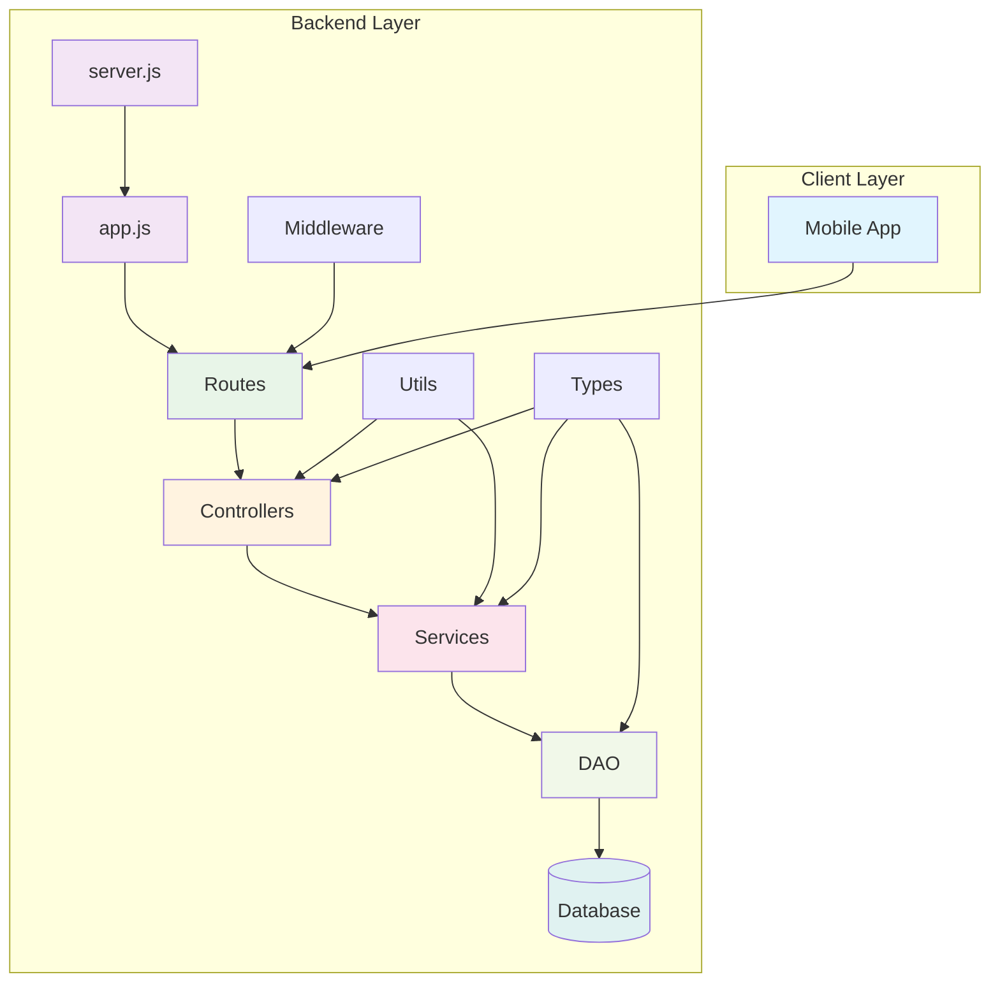
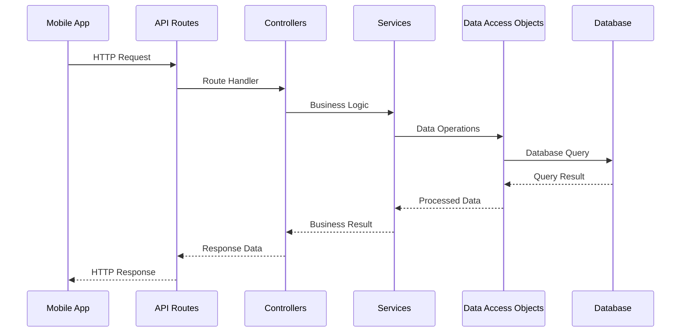

# Project Name

A full-stack application with Node.js backend and mobile client.

## Project Structure

```
├── backend/
│   ├── server.js                 # Entry point for the backend server
│   ├── src/
│   │   └── app.js               # Express app setup and middleware
│   ├── controller/              # Controllers for handling business logic
│   ├── dao/                     # Data access objects for database operations
│   ├── middleware/              # Custom middleware functions
│   ├── routes/                  # API route definitions
│   ├── services/                # Service layer for business logic
│   ├── type/                    # Type definitions (TypeScript/JSDoc)
│   └── utils/                   # Utility/helper functions
├── mobile/                      # Mobile client code
└── scripts/                     # Build and deployment scripts
```

## Architecture Overview



## Request Flow



## Getting Started

### Prerequisites

- Node.js (v14 or higher)
- npm or yarn
- Database (MongoDB/PostgreSQL/MySQL)

### Installation

1. Clone the repository:
```bash
git clone <repository-url>
cd <project-name>
```

2. Install backend dependencies:
```bash
cd backend
npm install
```

3. Set up environment variables:
```bash
cp .env.example .env
# Edit .env with your configuration
```

4. Start the development server:
```bash
npm run dev
```

### Available Scripts

From the `backend` directory:

- `npm run dev` - Start the server in development mode
- `npm start` - Start the server in production mode
- `npm test` - Run tests
- `npm run build` - Build the project

## API Documentation

### Base URL
```
http://localhost:3000/api
```

### Response Format
```json
{
  "success": true,
  "data": {},
  "message": "Success message",
  "timestamp": "2025-01-01T00:00:00Z"
}
```

## Layer Responsibilities

### Controllers
- Handle HTTP requests and responses
- Input validation
- Call appropriate services
- Format response data

### Services
- Implement business logic
- Coordinate between different data sources
- Handle complex operations
- Validate business rules

### DAO (Data Access Objects)
- Database operations
- Query building
- Data mapping
- Connection management

### Middleware
- Authentication and authorization
- Request logging
- Error handling
- Rate limiting

### Utils
- Helper functions
- Common utilities
- Configuration management
- Constants

## Environment Variables

Create a `.env` file in the backend directory:

```env
# Server Configuration
PORT=3000
NODE_ENV=development

# Database Configuration
DB_HOST=localhost
DB_PORT=5432
DB_NAME=your_database
DB_USER=your_username
DB_PASSWORD=your_password

# JWT Configuration
JWT_SECRET=your_jwt_secret
JWT_EXPIRES_IN=24h

# Other configurations
LOG_LEVEL=debug
```

## Contributing

1. Fork the repository
2. Create a feature branch (`git checkout -b feature/amazing-feature`)
3. Commit your changes (`git commit -m 'Add some amazing feature'`)
4. Push to the branch (`git push origin feature/amazing-feature`)
5. Open a Pull Request

## License

This project is licensed under the MIT License - see the [LICENSE](LICENSE) file for details.

## Support

For support, email abhishekkushwahaak0121@gmail.com or create an issue in the repository.