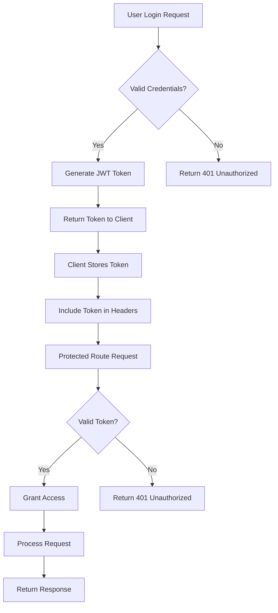
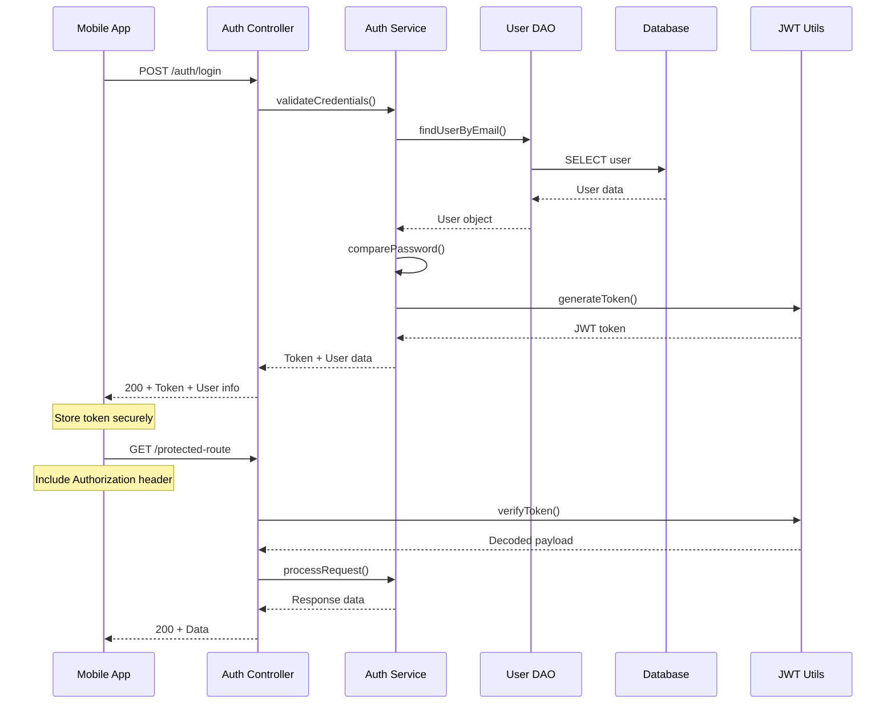
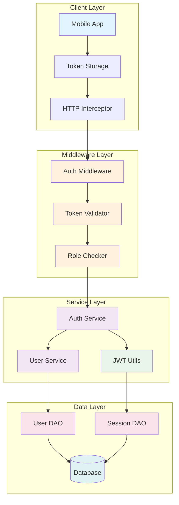
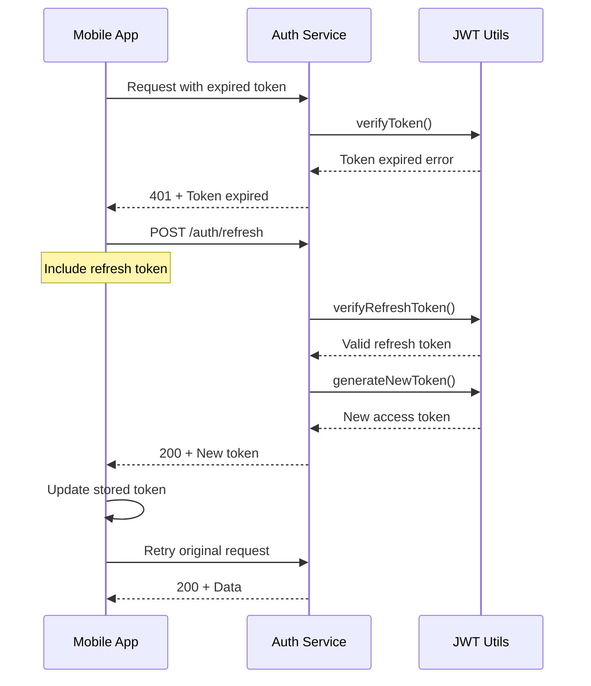
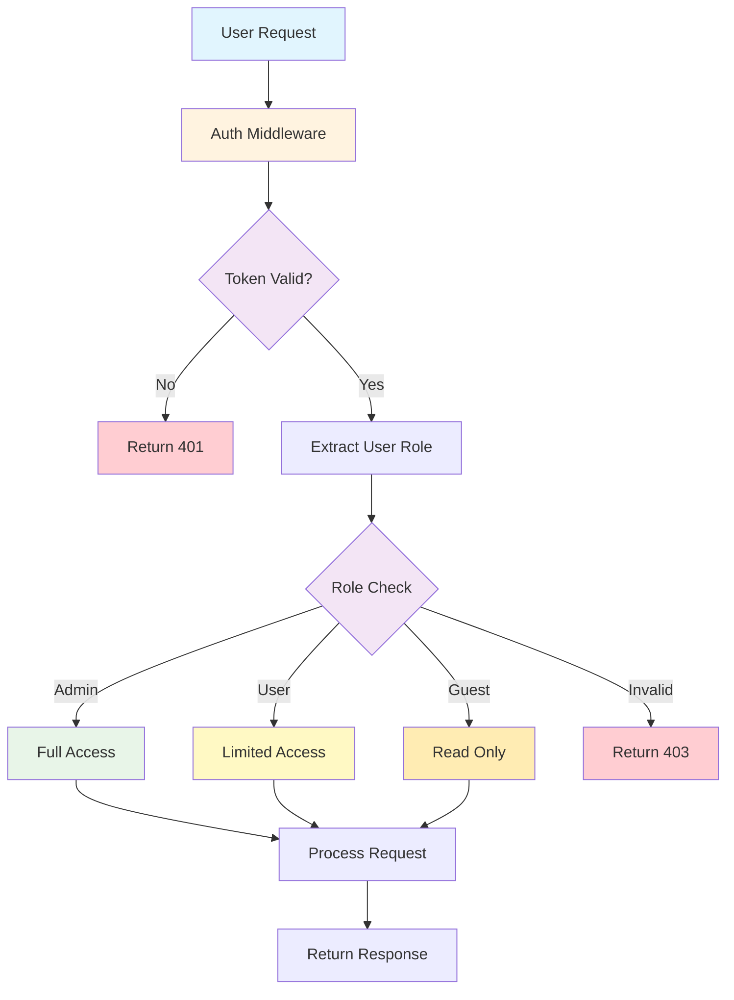

# Authentication Documentation

This document outlines the authentication system architecture and implementation details for the project.

## Authentication Flow Overview



## JWT Token Lifecycle



## Authentication Architecture



## Authentication Endpoints

### POST /auth/register
Register a new user account.

**Request Body:**
```json
{
  "email": "user@example.com",
  "password": "password123",
  "firstName": "John",
  "lastName": "Doe"
}
```

**Response:**
```json
{
  "success": true,
  "data": {
    "user": {
      "id": "user_id",
      "email": "user@example.com",
      "firstName": "John",
      "lastName": "Doe"
    },
    "token": "jwt_token_here"
  },
  "message": "User registered successfully"
}
```

### POST /auth/login
Authenticate user and return JWT token.

**Request Body:**
```json
{
  "email": "user@example.com",
  "password": "password123"
}
```

**Response:**
```json
{
  "success": true,
  "data": {
    "user": {
      "id": "user_id",
      "email": "user@example.com",
      "firstName": "John",
      "lastName": "Doe",
      "role": "user"
    },
    "token": "jwt_token_here",
    "expiresIn": "24h"
  },
  "message": "Login successful"
}
```

### POST /auth/logout
Invalidate the current session.

**Headers:**
```
Authorization: Bearer <jwt_token>
```

**Response:**
```json
{
  "success": true,
  "message": "Logout successful"
}
```

### GET /auth/profile
Get current user profile (protected route).

**Headers:**
```
Authorization: Bearer <jwt_token>
```

**Response:**
```json
{
  "success": true,
  "data": {
    "user": {
      "id": "user_id",
      "email": "user@example.com",
      "firstName": "John",
      "lastName": "Doe",
      "role": "user",
      "createdAt": "2025-01-01T00:00:00Z"
    }
  }
}
```

## Token Refresh Flow



## Role-Based Access Control



## Security Best Practices

### Token Security
- Use HTTPS in production
- Store tokens securely (Keychain/Keystore)
- Implement token rotation
- Set appropriate expiration times
- Use secure random secrets

### Password Security
- Hash passwords with bcrypt
- Implement password strength requirements
- Use salt for hashing
- Implement rate limiting for login attempts
- Account lockout after failed attempts

### API Security
- Validate all inputs
- Implement CORS properly
- Use helmet for security headers
- Implement request rate limiting
- Log security events

## Implementation Examples

### Auth Middleware
```javascript
// middleware/auth.js
const jwt = require('jsonwebtoken');
const { promisify } = require('util');

const authMiddleware = async (req, res, next) => {
  try {
    const token = req.headers.authorization?.split(' ')[1];
    
    if (!token) {
      return res.status(401).json({
        success: false,
        message: 'Access token required'
      });
    }
    
    const decoded = await promisify(jwt.verify)(token, process.env.JWT_SECRET);
    req.user = decoded;
    next();
  } catch (error) {
    return res.status(401).json({
      success: false,
      message: 'Invalid token'
    });
  }
};
```

### Role Middleware
```javascript
// middleware/role.js
const roleMiddleware = (requiredRoles) => {
  return (req, res, next) => {
    if (!requiredRoles.includes(req.user.role)) {
      return res.status(403).json({
        success: false,
        message: 'Insufficient permissions'
      });
    }
    next();
  };
};
```

## Error Handling

### Common Auth Errors
- `401 Unauthorized`: Invalid or missing token
- `403 Forbidden`: Insufficient permissions
- `422 Unprocessable Entity`: Invalid credentials
- `429 Too Many Requests`: Rate limit exceeded

### Error Response Format
```json
{
  "success": false,
  "error": {
    "code": "INVALID_TOKEN",
    "message": "The provided token is invalid or expired"
  },
  "timestamp": "2025-01-01T00:00:00Z"
}
```

## Testing Authentication

### Unit Tests
- Test token generation and validation
- Test password hashing and comparison
- Test middleware functions
- Test role-based access control

### Integration Tests
- Test complete authentication flow
- Test protected routes
- Test token refresh
- Test logout functionality

## Monitoring and Logging

### Security Events to Log
- Login attempts (success/failure)
- Token generation and validation
- Role elevation attempts
- Suspicious activity patterns
- API rate limit violations

### Metrics to Track
- Authentication success rate
- Token refresh frequency
- Failed login attempts by IP
- Session duration statistics
- API endpoint access patterns