# Development Workflow Documentation

This document outlines the development workflow, processes, and best practices for the project team.

## Git Workflow

```mermaid
gitgraph
    commit id: "Initial commit"
    branch develop
    checkout develop
    commit id: "Setup project structure"
    
    branch feature/user-auth
    checkout feature/user-auth
    commit id: "Add login endpoint"
    commit id: "Add registration logic"
    commit id: "Add password validation"
    
    checkout develop
    merge feature/user-auth
    commit id: "Merge auth feature"
    
    branch feature/user-profile
    checkout feature/user-profile
    commit id: "Add profile endpoints"
    commit id: "Add profile validation"
    
    checkout develop
    merge feature/user-profile
    
    branch release/v1.0
    checkout release/v1.0
    commit id: "Bump version to 1.0"
    commit id: "Update changelog"
    
    checkout main
    merge release/v1.0
    commit id: "Release v1.0"
    
    checkout develop
    merge release/v1.0
```

## Development Process Flow

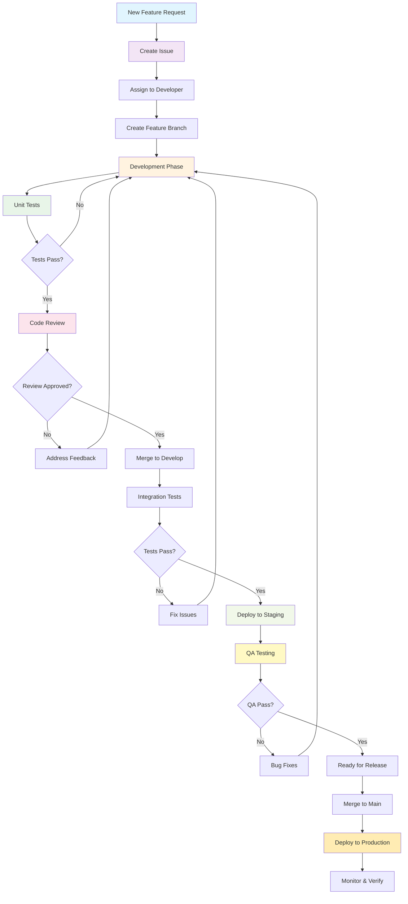

## Branch Strategy

### Branch Types

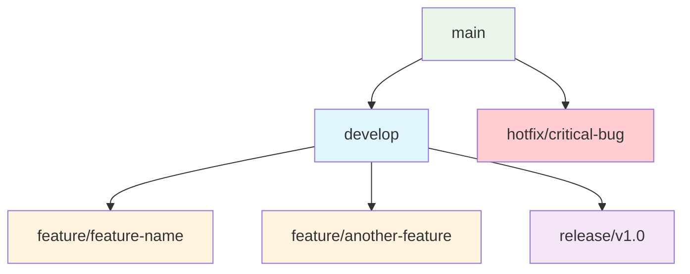

### Branch Naming Convention
- `main` - Production-ready code
- `develop` - Integration branch for features
- `feature/feature-name` - Feature development
- `release/v1.0` - Release preparation
- `hotfix/bug-description` - Critical production fixes
- `bugfix/bug-description` - Non-critical bug fixes

## Code Review Process

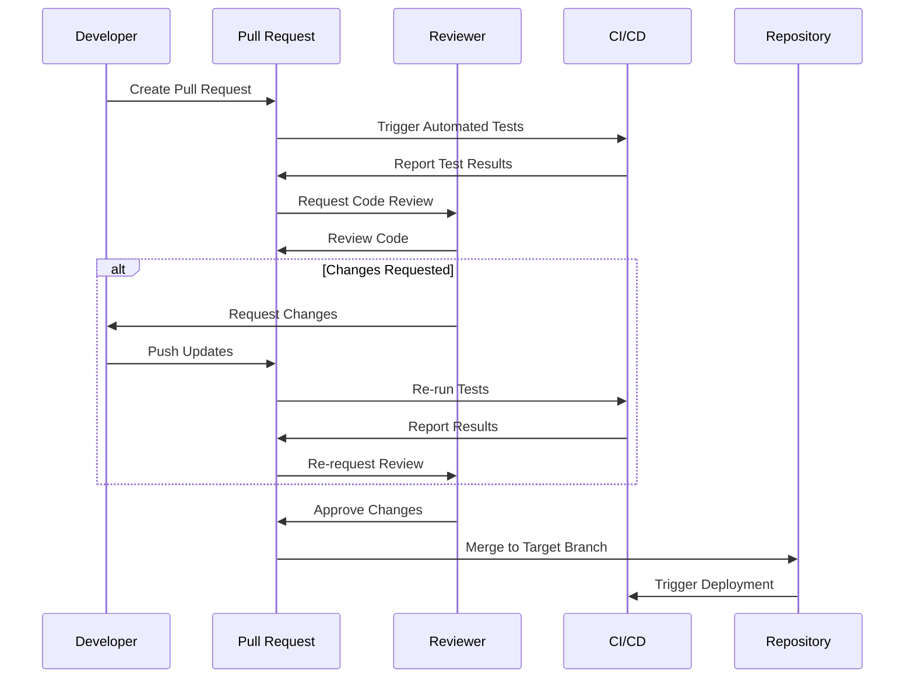

## Issue Management Workflow

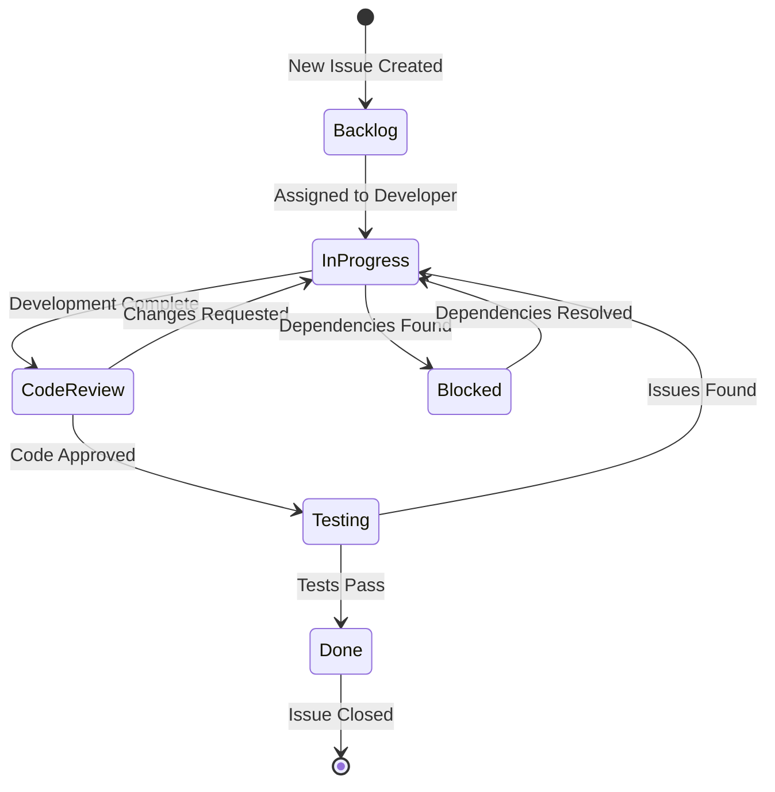

## Release Process

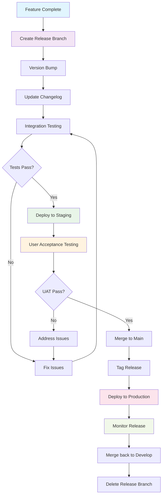

## CI/CD Pipeline

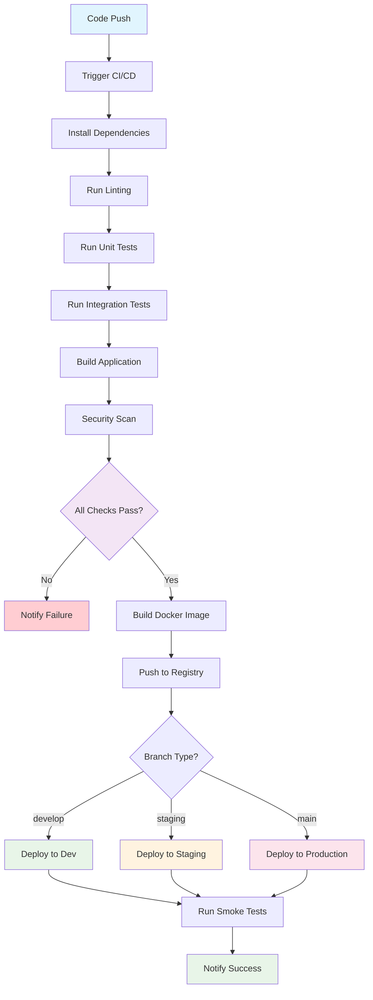

## Development Environment Setup

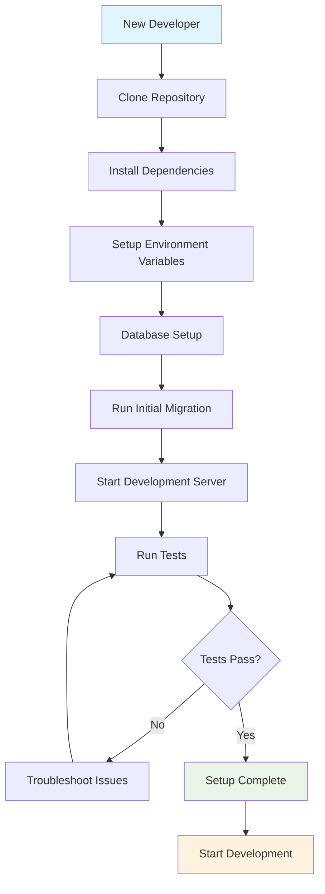

## Code Quality Standards

### Linting and Formatting
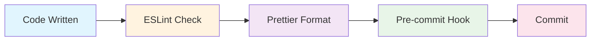

### Testing Strategy
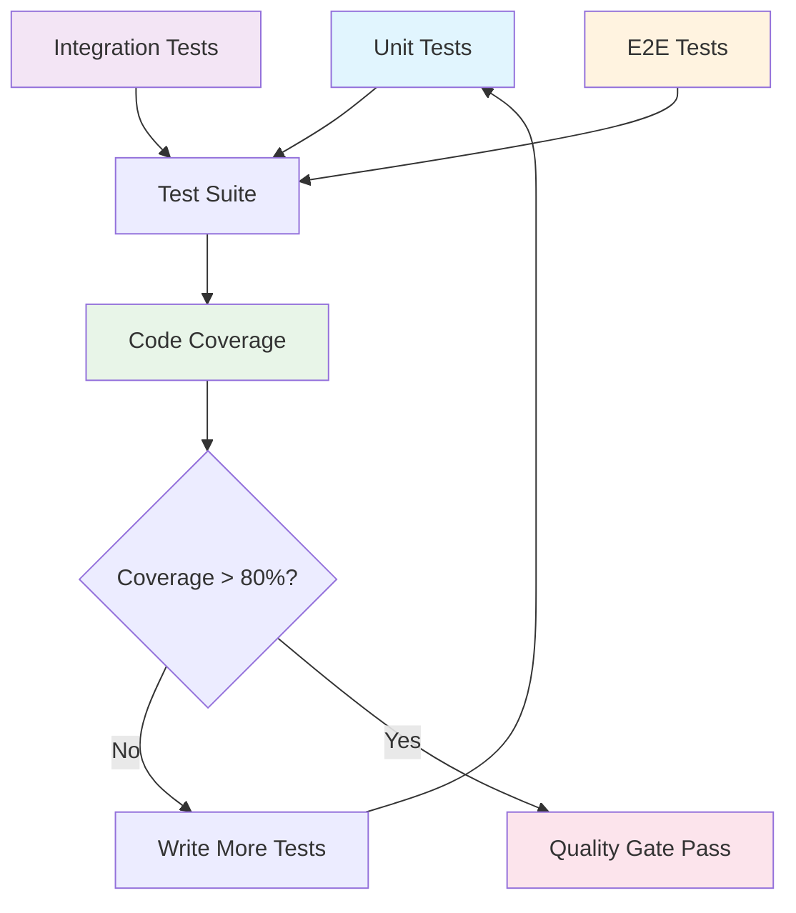

## Sprint Planning Workflow

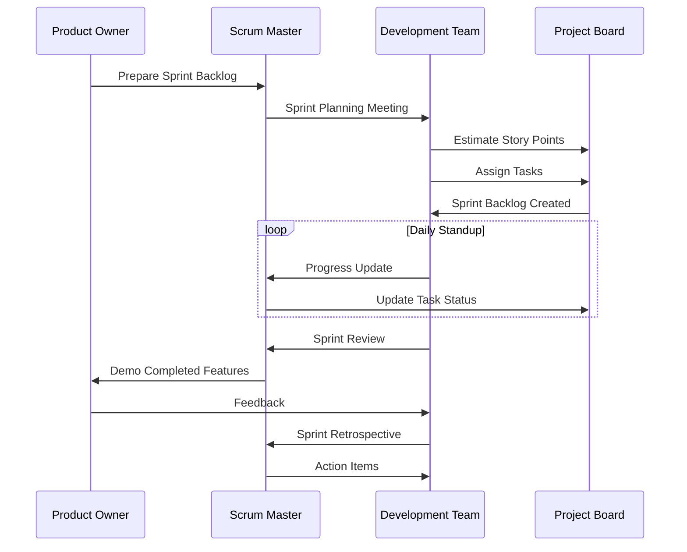

## Deployment Workflow

### Development Environment
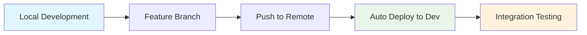

### Staging Environment
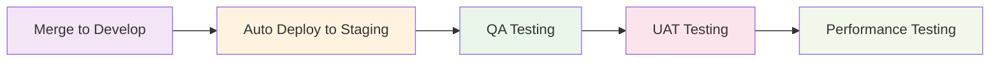

### Production Environment
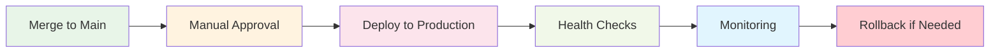

## Workflow Commands

### Git Commands
```bash
# Start new feature
git checkout develop
git pull origin develop
git checkout -b feature/new-feature

# Commit changes
git add .
git commit -m "feat: add new feature"

# Push feature branch
git push origin feature/new-feature

# Create pull request (GitHub CLI)
gh pr create --title "Add new feature" --body "Description"

# Merge and cleanup
git checkout develop
git pull origin develop
git branch -d feature/new-feature
```

### Development Commands
```bash
# Setup development environment
npm install
npm run setup:env
npm run db:migrate
npm run db:seed

# Development workflow
npm run dev          # Start development server
npm run test         # Run tests
npm run test:watch   # Run tests in watch mode
npm run lint         # Run linting
npm run format       # Format code

# Build and deployment
npm run build        # Build for production
npm run deploy:dev   # Deploy to development
npm run deploy:staging # Deploy to staging
npm run deploy:prod  # Deploy to production
```

## Code Review Checklist

### Before Creating PR
- [ ] Code follows project standards
- [ ] Tests are written and passing
- [ ] Documentation is updated
- [ ] No console.log statements
- [ ] Error handling is implemented
- [ ] Security considerations addressed

### During Review
- [ ] Code is readable and maintainable
- [ ] Logic is correct and efficient
- [ ] Tests cover edge cases
- [ ] No hardcoded values
- [ ] Proper error handling
- [ ] Security vulnerabilities checked

### After Review
- [ ] All feedback addressed
- [ ] CI/CD pipeline passes
- [ ] Documentation updated
- [ ] Performance impact considered
- [ ] Backward compatibility maintained

## Hotfix Process

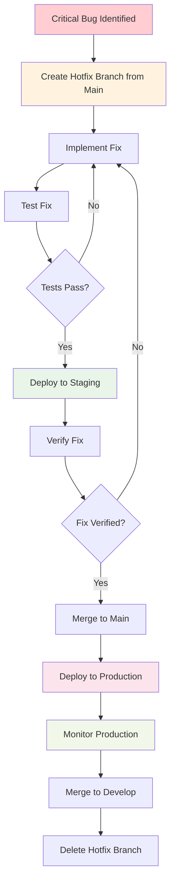

## Best Practices

### Commit Messages
- Use conventional commits format
- Keep subject line under 50 characters
- Use imperative mood ("Add feature" not "Added feature")
- Include context in body if needed

### Pull Requests
- Keep PRs small and focused
- Write clear descriptions
- Include testing instructions
- Link to related issues
- Request specific reviewers

### Code Quality
- Follow DRY principles
- Write self-documenting code
- Use meaningful variable names
- Keep functions small and focused
- Handle errors gracefully

### Testing
- Write tests before code (TDD)
- Maintain high test coverage
- Test edge cases and error conditions
- Use descriptive test names
- Mock external dependencies

## Monitoring and Metrics

### Development Metrics
- Code review time
- Build success rate
- Deployment frequency
- Lead time for changes
- Mean time to recovery

### Quality Metrics
- Code coverage percentage
- Bug discovery rate
- Technical debt ratio
- Code duplication
- Cyclomatic complexity

## Troubleshooting Common Issues

### CI/CD Pipeline Failures
1. Check test failures
2. Verify environment variables
3. Check dependency conflicts
4. Review recent changes
5. Check resource limits

### Deployment Issues
1. Verify environment configuration
2. Check database migrations
3. Review service dependencies
4. Check resource allocation
5. Monitor application logs

### Code Review Delays
1. Assign specific reviewers
2. Keep PRs small
3. Provide clear context
4. Follow up on reviews
5. Address feedback promptly